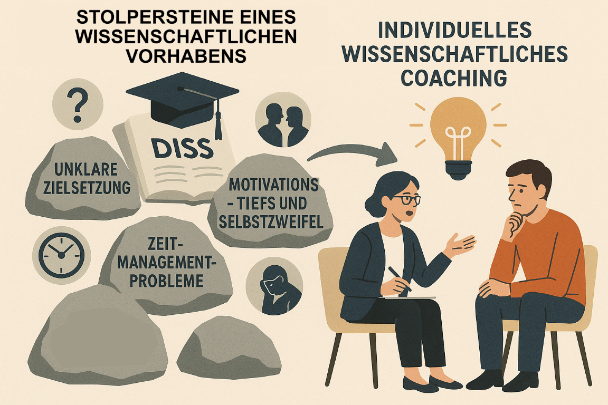

Ein wissenschaftliches Vorhaben wie eine Abschluss- / Seminararbeit oder eine Promotion ist oft ein anspruchsvoller und langer Weg – geprägt von fachlichen, organisatorischen und persönlichen Herausforderungen. Zu den häufigsten **Stolpersteinen** zählen:

* **Unklare Zielsetzung**: Wenn das Forschungsvorhaben nicht klar umrissen ist, verliert man leicht den roten Faden.
* **Zeitmanagement-Probleme**: Die Balance zwischen Forschung, Lehre, Nebenjobs und Privatleben gerät oft aus dem Gleichgewicht.
* **Motivationstiefs und Selbstzweifel**: Gerade in langen Schreibphasen oder bei Rückschlägen sind Frust und Blockaden keine Seltenheit.
* **Konflikte mit Betreuenden**: Missverständnisse oder mangelnde Kommunikation können das Projekt belasten.
* **Isolation**: Viele Promovierende fühlen sich mit ihren Problemen allein – fachlich wie emotional.

Ein **individuelles wissenschaftliches Coaching** kann hier frühzeitig und gezielt unterstützen: Es hilft, den Fokus zu schärfen, Prioritäten zu setzen, Blockaden zu lösen und Selbstvertrauen zu stärken. So wirkt es nicht nur **vorbeugend**, sondern kann auch **heilend eingreifen**, wenn das Projekt ins Stocken geraten ist.

Treffen oben genannte Punkte auf Dich zu, kann ich Dich womöglich unterstützen. [Vereinbare dazu gerne ein kostenloses und unverbindliches Erstgespräch und wir identifizieren und besprechen mögliche Optionen.](https://outlook.office.com/bookwithme/user/53cc80439963431e8085568c8e75ade8@iosb.fraunhofer.de/meetingtype/ChzMP5TZA0GygWOqJyOQvg2?bookingcode=197fbf10-2c1b-48bf-b03c-e7853e593163&anonymous&ismsaljsauthenabled&ep=mlink)